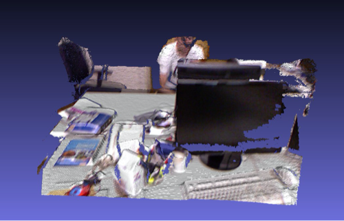

## Kinect Fusion

### Project overview

The goal of this project is to obtain a 3D reconstruction of a static scene which was recorded with a Kinect camera. The Kinect camera provides RGB as well as depth information as can be seen in the picture below.

### Results

Below you can see a result of a raycast which was performed after ~120 frames.

### How to run the code?

First clone the repo with `git clone https://github.com/VladimirYugay/KinectFusion.git`.

#### Setup (Linux)

- Install `cmake` if it's not installed yet\
  `sudo apt-get install cmake`

- Run `sudo apt-get install libfreeimage3 libfreeimage-dev` in order to be able to process images from the dataset by simulating the virtal sensor

- Download header only Eigen library and put it into `libs` folder by runnning:\
  `cd KinectFusion/libs`\
  `git clone https://gitlab.com/libeigen/eigen.git`\
  Use any stable release (e.g. 3.4.0) as the upstream currently requires specific compiler versions (newer than GCC 9.3.0 and Intel 2021.4.0.20210910)\
  `cd eigen`\
  `git checkout tags/3.4.0`

#### Setup (Windows)

- Follow the same file structure as in Linux Setup
- Add pre-compiled libraries of FreeImage in `KinectFusion/libs`

#### Setup (Mac)
- `brew install eigen`
- `brew install freeimage`

#### Download dataset
You can either use your own image sequence which was recorded with a Kinect Camera v2 or you can download the same dataset we used [here](https://vision.in.tum.de/rgbd/dataset/freiburg1/rgbd_dataset_freiburg1_xyz.tgz).
Extract the folder and move it to `KinectFusion/data/rgbd_dataset_freiburg1_xyz`.

#### Build and run
In order to build and run the project follow these steps:

  `cd ..`\
  `mkdir build`\
  `cd build`\
  `cmake ..`\
  `make`\
  `./kinect_fusion`

#### Contributer Guidelines
If you want to contribute, please use `cpplint`.
You can install it via `pip install cpplint` and run with: `cpplint [OPTIONS] files`.

#### CUDA Implementation details

You can find GPU implementation on ``vy/unstable/gpu_integration`` and ``vy/icp/gpu_icp_pose_estimation`` branches

Things implemented on CUDA
1. Finding correspondences
2. ICP linear system construction ``vy/icp/gpu_icp_pose_estimation``
3. Volume integration

| CPU  | GPU | Ratio |
| ------------- | ------------- | ------------- |
| Correspondences: 138,609  | Correspondences: 23,792  | 6
| Volume integration: 8,787,468  | Volume integration: 694,208  | 12
| Linear System: 277  | Linear System: 488  | 0.7